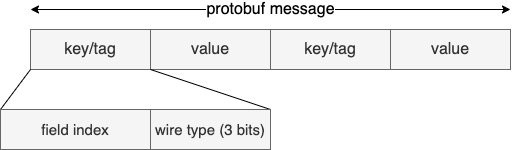
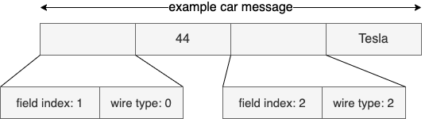
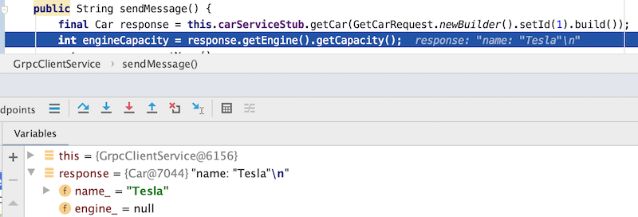
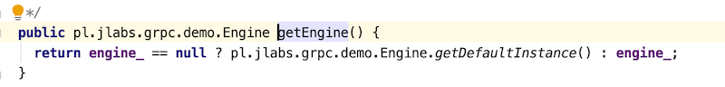

# Practical guide to gRPC in Java

gRPC is an open-source language-agnostic RPC framework. It was developed at Google in 2015 based on experience 
with Stubby - their own framework used internally to handle billions of requests per second.

## Comparison with SOAP and Rest

This article is based on my experience in using Stubby and gRPC for quite some time. I assume basic 
knowledge about what is gRPC i.e. how to define a service in .proto file and write
server and client code in Java.

However if you are new to gRPC you may want to read first: 
 - [gRPC basics in Java tutorial](https://grpc.io/docs/tutorials/basic/java/)
 - [gRPC Spring Boot Starter](https://github.com/yidongnan/grpc-spring-boot-starter) with many examples
 - and our [previous blog article](https://blog.j-labs.pl/2019/04/gRPC-over-HTTP2-or-How-I-learned-to-stop-depending-on-REST-and-love-gRPC)

To summarize the knowledge and compare it with two other most widely used webservice standards: SOAP and Rest I attach the following table.

|               | SOAP           | Rest  | gRPC|
| ------------- |:-------------:| :-----| ---:|
|Contract| required - contract-first of contract-last | not required - can be contract-first or contract-last | required - contract-first|
|Contract format     | WSDL | depending on tool, most popular is YAML  |  proto file |
| data exchange format      | usually XML      |   usually JSON | protocol buffers |

To me, it's more similar to SOAP since you have mandatory contract but much easier to use.

gRPC makes development in Java quite easy (null-safety and immutability by default) and 
it is very hard to break its compability while developing new versions of the contract. This
is very important feature in large distributed systems.

So let's discuss its features in details!

## Protocol buffers under the hood

You may have heard that protocol buffers (a.k.a. protobuf) is binary wire format. Unlike other data 
exchange formats like XML, JSON or YAML it is not human readable, yet it is quite important 
to know how it is built.
Each protobuf message consists of series of key-value pairs. Key specifies which message from 
 proto definition we are sending and of what type.



Let's examine it on simple example. We have Car message definition and we set it's id to "44" and 
name to "Tesla"

```
message Car {
  int32 id = 1;
  string name = 2;
}
```

Based on [protobuf encoding guide](https://developers.google.com/protocol-buffers/docs/encoding) 
the protobuf message will look like that:



We will not dig into how string or numeric values are encoded, it's not important for the sake of 
this article. It is worth to know it was designed to outperform other formats like JSON or XML 
in terms of network load but if you are interested in details you can find it in the aforementioned protobuf guide.

## Required, optional and default values

In older version of proto specification, namely *proto2*, you were able to specify if a field is *required* or *optional*.
However *required* have been removed from the new proto3 syntax all fields are optional now. 
There were long discussions and debates about 
usefulness of *required* keyword; long story short - the argument against *required* is that 
you cannot add or remove required field to not break wire compatibility with previous version of a contract. 
Therefore all fields in proto3 are optional. Since all fields became not-required optional keyword was also dropped from proto3.

Ok, but what does it exactly mean that the field is optional? In database world we usually 
set not-null constraint if we require value to be present. In Java we also usually enforce that presence
is required by checking if value is not null. This doesn't apply to primitives which are initialized
 automatically with their default values. 
Proto fields are more like Java primitives. Scalar proto fields are never null - if not set 
they evaluate to default values i.e.
- zero for numeric fields
- false for boolean
- empty string for string

You can check full list in [Proto3 language guide](https://developers.google.com/protocol-buffers/docs/proto3#default)

sources:
https://github.com/protocolbuffers/protobuf/issues/2497
https://stackoverflow.com/questions/31801257/why-required-and-optional-is-removed-in-protocol-buffers-3
https://capnproto.org/faq.html#how-do-i-make-a-field-required-like-in-protocol-buffers

## Proto files backward compatibility

Armed with the knowledge about how protocol buffers work and default values let's have a look at example.

Assume we have car rental company and we share API for car aggregators. As a part of proto3 we 
have the following Car message definition. This is of course overly simplified for sake of clarity.
```
message Car {
  int32 id = 1;
  string name = 2;
  string description = 3;
  Color color = 4;
}

enum Color {
  UNSPECIFIED = 0;
  BLACK = 1;
  PINK = 2;
  RED = 3;
}
```

Now, we realize that our customers don't care about color of a car but they are interested
in number of seats available. We also decided to change *description* to *additional information* 
- just the name of the field, we still store the same information there.

This is our new Car message definition:
```
message Car {
  int32 id = 1; 
  string name = 2;
  string additional_information = 3; // (#1) change description to additional_information
  // (#2) remove color
  int32 number_of_seats = 5; (#3) add number_of_seats
  
}
```
The question is: can we deploy this service to production knowing that many clients
are already using the service? Are we risking that clients' services will crash? Let's examine these cases one by one:

1. We change field's name to additional_information. At first sight it seems like this is breaking
change but is it really? Let's recall how the message is send over the wire - the key by which we 
identify the value is only field index ("3" in our case which didn't change) and wire type (string) 
which also didn't change. (caveat: it will not work when you use Field Masks)
2. Removal of color enum also does not seem safe. However it is - if we don't send color over the
wire and the client will have old version of the proto, it will automatically evaluate to default value,
which in case of enum is whatever we assign to zero (UNDEFINED in our case)
3. Addition of another field is also backward compatible - client with old version will just ignore
message with unknown index.

## Using gRPC in Java
As noted before, gRPC is always contract-first and in each language we get the code generated
based on a proto contract. I wanted to stress two main features of Java generated code:
- It's messages are used using Builder pattern and are once build are immutable
- It's (almost) impossible to get NullPointerException which manipulating protobuf objects.

I think the purpose of the first on is quite clear, it enables to use it in a thread-safe manner.
However, what is even better about using gRPC Pojos in Java is the fact that you don't have to care 
about checking for nulls.

Why is that? I already mentioned that default scalar values in proto are naver null.
It's zero for numeric, false for boolean etc.

However, how about nested messages? [Developers guide](https://developers.google.com/protocol-buffers/docs/proto3#default) 
says "for message fields, the field is not set. Its exact value is language-dependent."
It's a bit unclear and it's hard to find answer for Java, so let's try to test it. 

We modify Car message to have some nested message there. Let it be *Engine*:

```
service CarService {
    rpc GetCar (GetCarRequest) returns (Car) {
    }
}

message Car {
    string name = 1;
    Engine engine = 2;
}

message Engine {
    int32 capacity = 1;
    int32 torque = 2;
}

```

On the server side we populate Car object like that (notice that we don't set Engine at all, only name)

```
Car reply = Car.newBuilder().setName("Tesla").build();
```

On the client side we deserialize the message:




and we see in debug mode that engine is null so we expect NullPointerExcception while invoking the next line:
```
int engineCapacity = response.getEngine().getCapacity();
```
But instead we get "0" assigned as engineCapacity. Why is that? Let's have a look what engine getter does:



Well get a new object with default values created ad-hoc. So instead of writing
```
Optional.ofNullable(response.getEngine()).map(Engine::getCapacity).orElse(0);
```
So we can chain getters without any null checks. How cool is that, right?

## Field masks
So far so good, we no longer care about infamous NullPointerException. Unfortunately, there is no
rose without a thorn. Null is also same kind of information, which we are not able to transmit via gRPC.
Let's assume that we would like to update resource partially, like in PATCH method of REST. 
Normally you wouldn't send just values you want to update, usually
that means that value is null. However, this is not the case with gRPC. 
Remember, that even if you don't send the value over the wire it 
will be evaluated to default value while deserializing. If you have empty string how do you know
if it means "don't update the value" or "set value to empty"?

That's why gRPC developers come up with [FieldMasks](https://developers.google.com/protocol-buffers/docs/reference/java/com/google/protobuf/FieldMask) 
which are used to specify a subset of fields 
that should be modified by an update operation (or returned by get operation). Field Mask is just 
a set of field names (yes, names, that's why you need to be careful changing the contract when using Field Mask)
which are to be modified.


##

## References
https://developers.google.com/protocol-buffers/docs/encoding

https://grpc.io/

https://stackoverflow.com/questions/31801257/why-required-and-optional-is-removed-in-protocol-buffers-3

https://capnproto.org/faq.html#how-do-i-make-a-field-required-like-in-protocol-buffers